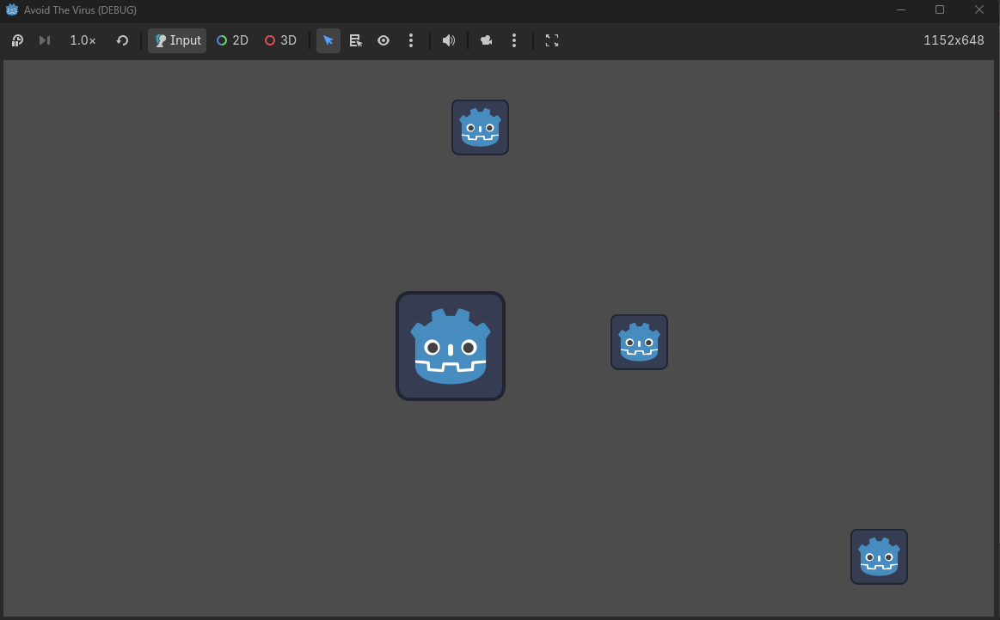

# Avoid The Virus v0

Simple 2D dodge game built with Godot Engine.

## Gameplay
- Move using WASD / Arrow Keys
- Avoid falling viruses
- Game restarts when hit

## Built With
- Godot Engine 4
- GDScript

## Features
- Player movement
- Enemy spawning system
- Collision detection
- Simple game over system

## Screenshot

## Future Updates
- Score system
- Sound effects
- Difficulty scaling
- Main menu
- Health system

## Author
Mika Respati
Chill to use

